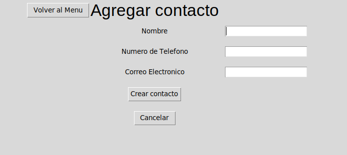
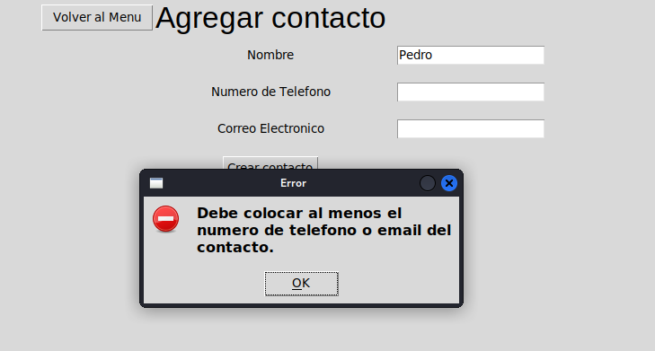
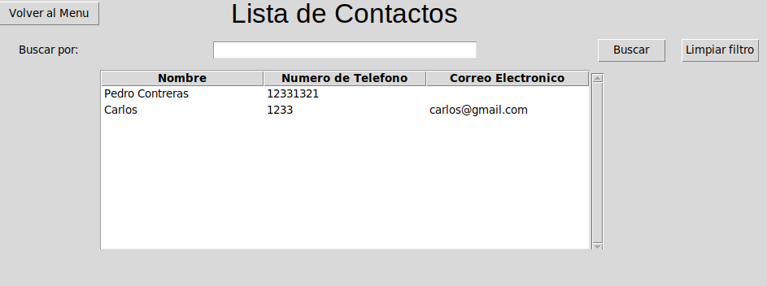
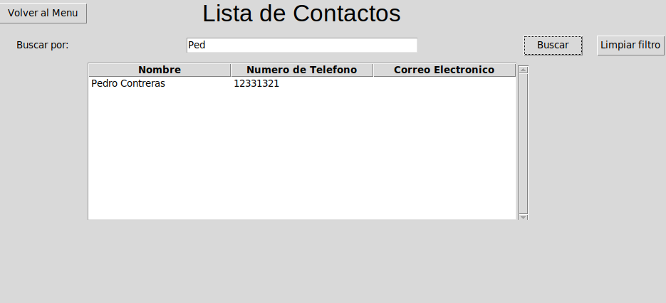

# AgendaPython

Aplicacion de agenda de contactos hecha en Python. La cual carga desde un archivo XML los campos que se deben renderizar en pantalla.

El proyecto sigue la siguiente estructura:

```bash
├── assets
│   ├── adderror.png
│   ├── add.png
│   ├── add-user.png
│   ├── contactfind.png
│   ├── contactlist.png
│   └── contacts.png
├── databases
│   └── contactos.db
├── logs.log
├── main.py
├── modules
│   ├── add_contact.py
│   ├── all_contacts.py
│   ├── dbqueries.py
│   ├── main_menu.py
│   └── __pycache__
│       ├── add_contact.cpython-311.pyc
│       ├── all_contacts.cpython-311.pyc
│       ├── dbqueries.cpython-311.pyc
│       ├── edit_contact.cpython-311.pyc
│       ├── find_contact.cpython-311.pyc
│       └── main_menu.cpython-311.pyc
├── README.md
└── views
    └── contact.xml
```

- En la carpeta **modules** se encuentran todos los archivos correspondientes a las vistas de tkinter separadas en clases, y todas las funciones necesarias para hacer las consultas a la base de datos.
- En la carpeta **databases** se encuentra el archivo contactos.db, el cual almacena toda la informacion de la aplicacion.
- En la carpeta **assets** se encuentran las imagenes utilizadas en la aplicacion.

Si el archivo **contactos.db** no se encuentra creado, el programa lo creara automaticamente junto con la siguiente tabla:

```SQL
CREATE TABLE contactos (nombre TEXT NOT NULL, telefono TEXT NOT NULL, email TEXT NOT NULL);
```
Tambien se encuentra un archivo en la carpeta raiz llamada **logs.log** el cual registra las acciones realizadas en la aplicacion, por ejemplo:

```bash
NFO:root:Connecting to sqlite database
INFO:root:Connected successfully
INFO:root:Checking if contactos.db exists
INFO:root:contactos.db does not exists, creating file...
INFO:root:contactos.db successfully created!
INFO:root:Connecting to sqlite database
INFO:root:Connected successfully
INFO:root:Checking if contactos.db exists
INFO:root:contactos.db already exists!
INFO:root:Creating Tkinter frame container
INFO:root:Creating frames
INFO:root:Rendering frame all_contacts
INFO:root:Rendered successfully
INFO:root:Rendering frame add_contact
INFO:root:Rendered frame successfully
INFO:root:Rendering <class 'modules.main_menu.Menu'>
INFO:root:Rendering <class 'modules.add_contact.Add'>
INFO:root:Building view from ./views/contact.xml
INFO:root:Parsing XML...
INFO:root:XML successfully parsed
INFO:root:View built successfully!
INFO:root:Checking contact data
INFO:root:Adding record ['TEST CONTACT', '01230123', 'a@app.com'] on contactos
INFO:root:Query executed successfully
INFO:root:Rendering <class 'modules.main_menu.Menu'>
INFO:root:Rendering <class 'modules.all_contacts.All'>
INFO:root:Building view from ./views/contact.xml
INFO:root:Parsing XML...
INFO:root:XML successfully parsed
INFO:root:View built successfully!
INFO:root:Getting all data from contactos
INFO:root:Query executed successfully
INFO:root:Rendering <class 'modules.main_menu.Menu'>
INFO:root:Rendering <class 'modules.add_contact.Add'>
INFO:root:Building view from ./views/contact.xml
INFO:root:Parsing XML...
INFO:root:XML successfully parsed
INFO:root:View built successfully!
INFO:root:Checking contact data
INFO:root:Adding record ['mibb', '12313', 'mibb@bb.com'] on contactos
INFO:root:Query executed successfully
INFO:root:Rendering <class 'modules.main_menu.Menu'>
INFO:root:Rendering <class 'modules.all_contacts.All'>
INFO:root:Building view from ./views/contact.xml
INFO:root:Parsing XML...
INFO:root:XML successfully parsed
```
## Funciones
---

### Agregar

El programa puede agregar productos mediante el siguiente formulario:



El formulario comprueba si al menos se escribio en el formulario tanto un nombre como un dato de contacto. En caso de fallar alguna comprobacion, se le notifica al usuario con un mensaje por pantalla.


---

### Listar y buscar
El programa es capaz de listar todos los contactos que ya han sido registrados en la base de datos, adicionalmente, posee una barra de busqueda, el cual filtra la mejor coincidencia en la base de datos mediante la siguiente consulta:

```SQL
SELECT * FROM contactos WHERE nombre LIKE '%nombre%';
```


